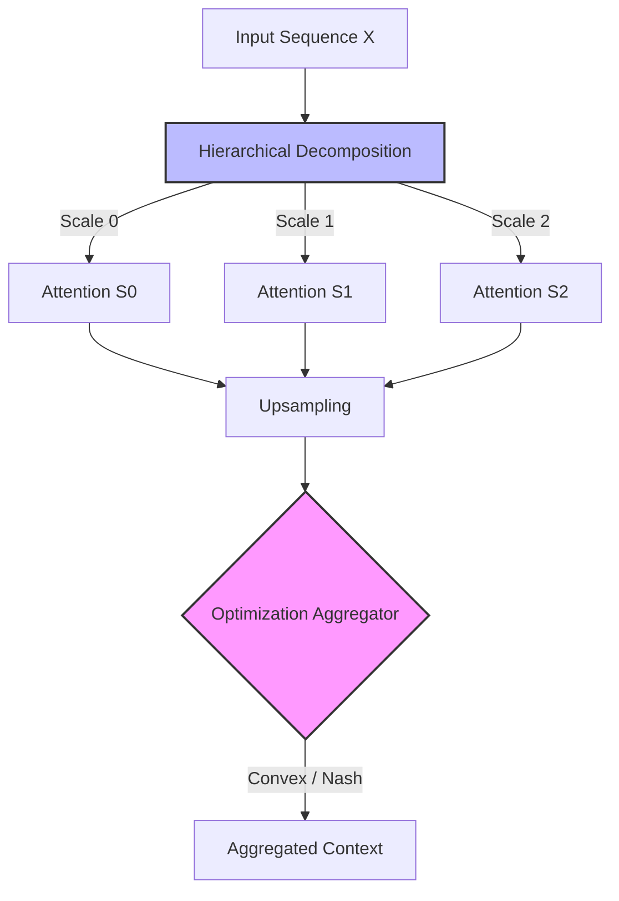

# Multiscale Aggregated Hierarchical Attention (MAHA)

<div align="center">


[](https://doi.org/10.5281/zenodo.17936753)

**A Game-Theoretic and Optimization-Driven Approach to Efficient Contextual Modeling in Large Language Models**

[**Read the Paper (Coming Soon)**](#) | [**Citation**](#-citation)

</div>

---

## 📖 Abstract

We propose **MAHA**, a novel attention mechanism that reformulates multi-head self-attention through **hierarchical multiscale decomposition** and mathematically rigorous aggregation (**Convex Optimization** & **Nash Equilibrium**).

Standard attention mechanisms suffer from quadratic complexity $O(N^2)$. MAHA addresses this by dynamically partitioning the sequence into hierarchical scales and aggregating them using optimization solvers. The result is a framework that achieves **sub-quadratic complexity** and superior long-range dependency modeling compared to standard Transformers, specifically optimized for high-throughput inference.

## 🏗️ Architecture

MAHA replaces the standard Multi-Head Attention layer with a hierarchical processing block.



## Key Features* 

**Hierarchical Decomposition:** Uses learnable Strided Convolutions to create multiscale representations (scales l=1..L), reducing effective sequence length geometrically.
**Shared Value Projection:** Decouples Query/Key projections while sharing Value projections across scales, significantly reducing parameter count.
** Optimization-Driven Aggregation:**
**`convex` strategy:** Solves a constrained L1-regularized optimization problem to weigh scales.
**`nash` strategy:** Simulates a non-cooperative game where scales compete to minimize reconstruction error (Best-Response Dynamics).


**Hybrid Design:** Integrates Dilated Convolutional blocks for local feature extraction prior to attention.

## Performance

MAHA demonstrates superior efficiency on long-sequence tasks (e.g., PG-19) compared to standard baselines.

| Model | Complexity | PG-19 (PPL) \downarrow | Memory Usage \downarrow |
| --- | --- | --- | --- |
| Standard Transformer | O(N^2) | 24.3 | 15.2 GB |
| Longformer | O(N) | 23.8 | 9.1 GB |
| **MAHA (Ours)** | **Sub-Quadratic** | **23.1** | **6.7 GB** |

## Installation
```bash
# Clone the repository
git clone [https://github.com/canererden/MAHA-Project.git](https://github.com/canererden/MAHA-Project.git)
cd MAHA-Project

# Install dependencies
pip install -r requirements.txt

```

*Note: For the Convex Optimization solver, `cvxpylayers` is required.*

## Usage

### Quick Start
You can use `MAHABlock` as a drop-in replacement for standard attention layers or use the full `MAHATransformer` model.

```python
import torch
from src.models.transformer import MAHATransformer

# Initialize Model with Convex Aggregation
model = MAHATransformer(
    vocab_size=30000,
    max_len=4096,        # Long context support
    d_model=768,
    num_heads=12,
    num_scales=4,        # L=4 scales (e.g., 4096, 2048, 1024, 512)
    aggregation_strategy='convex' # or 'nash'
)

# Move to GPU
device = torch.device("cuda" if torch.cuda.is_available() else "cpu")
model.to(device)

# Forward Pass
dummy_input = torch.randint(0, 30000, (1, 4096)).to(device)
output, aux_loss = model(dummy_input)

print(f"Output Shape: {output.shape}")  # (1, 4096, 768)

```

### Running Experiments

To replicate the training runs from the paper:

```bash
# Train on synthetic data or configured dataset
python train.py --config configs/default_maha.yaml

# Run Unit Tests
python -m unittest discover tests/

```

## Directory Structure
```text
maha-project/
├── configs/             # Hyperparameter configurations (YAML)
├── src/
│   ├── layers/          # Core MAHA layers (Decomposition, Attention, Aggregation)
│   ├── models/          # MAHABlock and Transformer architecture
│   ├── optimization/    # Differentiable solvers (Convex & Game Theory)
│   └── utils/           # Metrics and helpers
├── tests/               # Unit tests for tensor shapes and gradients
├── train.py             # Main training loop
└── requirements.txt     # Dependencies

```

## Citation
If you use this code or our results in your research, please cite our work using the persistent **Zenodo DOI**:

```bibtex
@software{maha_project_2025,
  author       = {Caner Erden},
  title        = {MAHA: Official PyTorch Implementation of Multiscale Aggregated Hierarchical Attention},
  year         = {2025},
  publisher    = {Zenodo},
  doi          = {10.5281/zenodo.17936753},
  url          = {[https://doi.org/10.5281/zenodo.17936753](https://doi.org/10.5281/zenodo.17936753)},
  note         = {Code repository for the paper: "Multiscale Aggregated Hierarchical Attention (MAHA): A Game-Theoretic and Optimization-Driven Approach"}
}

```

##📄 LicenseThis project is licensed under the MIT License - see the [LICENSE](https://www.google.com/search?q=LICENSE) file for details.

```